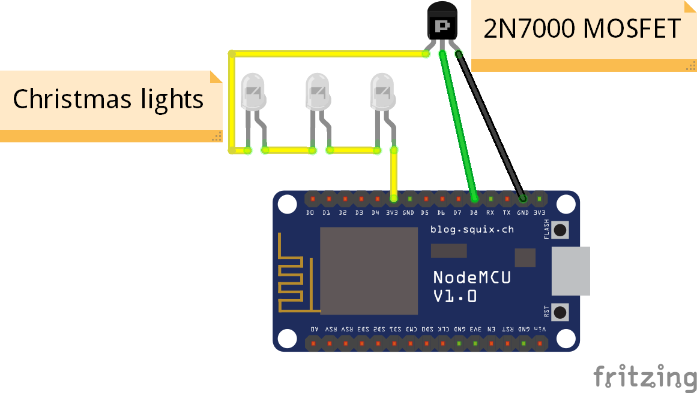

# Luke's internet connected Christmas Jumper

Because I like building ridiculous things, I decided to make a christmas jumper that can be controlled over the internet.

## Hardware

The brains of the whole lot is an ESP8266 running Espruino. This then has a string of battery powered christmas lights attached to it with a MOSFET between the end of the lights and the ground pin. The control pin of the MOSFET is then connected to one of the GPIO pins on the ESP8266 so that the lights can be controlled.

The ESP8266 connects to a Wifi source and then to an MQTT broker to recieve commands.

## Web Client
To send commands to the jumper, there's a web client. This uses MQTT.js to send commands to the MQTT broker. There is no server component, so you can host it on static hosting like Github Pages or Netlify.

## License
MIT
